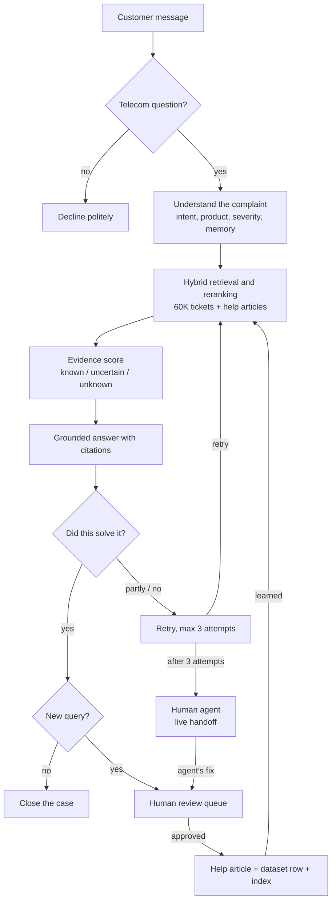

# Support IQ – Project Documentation

**Adaptive RAG-Based Telecom Support Resolution Assistant**

| | |
|---|---|
| Version | 1.0 |
| Date | October 2026 |
| Prepared by | ______________________ |

Related documents: [Design decisions](DESIGN_DECISIONS.md) ·
[Tech stack decisions](TECH_STACK_DECISIONS.md) ·
[Technical requirements](TECHNICAL_REQUIREMENTS.md) ·
[Testing requirements](TESTING_REQUIREMENTS.md) ·
[Requirements audit](PROJECT_REQUIREMENTS_AUDIT.md) · [README](README.md)

---

## Contents

1. [Introduction](#1-introduction)
2. [Problem statement](#2-problem-statement)
3. [Objectives](#3-objectives)
4. [Approach](#4-approach)
5. [System overview](#5-system-overview)
6. [Architecture](#6-architecture)
7. [Technology stack](#7-technology-stack)
8. [Dataset](#8-dataset)
9. [Modules](#9-modules)
10. [End-to-end workflows](#10-end-to-end-workflows)
11. [Customer website](#11-customer-website)
12. [Admin console](#12-admin-console)
13. [Database design](#13-database-design)
14. [API reference](#14-api-reference)
15. [Configuration](#15-configuration)
16. [Installation and running](#16-installation-and-running)
17. [Testing](#17-testing)
18. [Error handling and security](#18-error-handling-and-security)
19. [Project structure](#19-project-structure)
20. [Limitations and future work](#20-limitations-and-future-work)
21. [Conclusion](#21-conclusion)

---

## 1. Introduction

Support IQ is a customer support assistant we built for a telecom service provider. A
customer describes a problem in their own words, for example a SIM that is not detected,
mobile data that stops working, or a charge on the bill they do not recognise. The assistant
works out what the problem is, looks through past support tickets and help articles, and
replies with clear steps to fix it. Every step can be traced back to the ticket or article
it came from.

We did not want another chatbot that sounds confident but makes things up. The system is
built around a few simple rules:

- answer only from real evidence,
- say so when the evidence is weak,
- follow up when a fix does not work,
- never treat a new solution as trusted until a person on the support team has checked it.

The project has two connected parts:

- **Customer side** – a help-center website with a chat assistant, where customers search
  articles, chat with the assistant and can ask to speak to a person.
- **Admin side** – a console for the support team, where agents answer live chats, look at
  cases, review new solutions and track how the assistant is performing.

---

## 2. Problem statement

In most telecom support teams, agents still find solutions by typing keywords into a ticket
search. This works only when the customer happens to use the same words as an old ticket.
While studying this process we found several recurring problems:

- The same problem written differently ("my net keeps cutting out" vs "broadband
  disconnects every evening") is not matched to the same solution.
- Agents cannot see why a solution was suggested or where it came from.
- Problems that have never been seen before are pushed into the closest existing category,
  which leads to wrong answers.
- When a suggested fix does not work, there is no structured way to try something else or
  escalate.
- Fixes that work are rarely written back into the knowledge base, so the same problem is
  solved from scratch again and again.

Our aim was to build an assistant that finds the right evidence even when the wording
differs, gives grounded answers with citations, recognises unknown issues, reacts to
customer feedback, hands over to a human when needed, and keeps learning in a controlled
way.

---

## 3. Objectives

1. Understand each complaint: intent, category, product, severity, sentiment and details.
2. Retrieve relevant evidence with hybrid search (meaning, keywords and metadata).
3. Measure how strong the evidence is with a single evidence score.
4. Generate resolutions only from retrieved evidence, with a citation on every step.
5. Recognise unknown issues instead of forcing them into an existing category.
6. React to feedback: retry, ask for more information, or escalate.
7. Let new solutions become trusted only after human verification, then add them to the
   dataset.
8. Spot repeated unknown complaints and help the team create new issue types.
9. Remember the context of a conversation across messages.
10. Accept guided, typed and spoken input through one pipeline.
11. Connect the customer website and the admin console for live handoff.
12. Answer only telecom questions and politely decline anything unrelated.

---

## 4. Approach

We treated telecom support as an **evidence problem rather than a chatbot problem**. Every
answer is built from retrieved evidence, scored for reliability, checked against its sources,
and improved through feedback and human review.

| Stage | What we did |
|---|---|
| 1. Requirements | Broke the problem into modules and studied where keyword search fails |
| 2. Data | Validated the 60K dataset and split it by intent for fair evaluation |
| 3. Understanding | Scope check, intent, product, severity, sentiment, entities and memory |
| 4. Retrieval | Hybrid search (0.60 semantic + 0.25 BM25 + 0.15 metadata) plus reranking |
| 5. Confidence | Evidence score with Known / Uncertain / Unknown thresholds |
| 6. Generation | Answers only from evidence, cited, with a grounding check |
| 7. Feedback | Retry with details or new evidence, max 3 attempts, then a human |
| 8. Learning | Human review queue; approved fixes become articles and dataset rows |
| 9. Two sides | Customer website and admin console connected through the backend |
| 10. Testing | Automated tests plus manual end-to-end scenarios |

---

## 5. System overview



The key point is that the system never jumps straight from "yes, that worked" to trusted
knowledge. There is always a person in between.

---

## 6. Architecture

```
+---------------------------+       +---------------------------+
|  Customer website         |       |  Admin console (/admin)   |
|  help center + chat       |       |  inbox, cases, reviews    |
+-------------+-------------+       +-------------+-------------+
              |      REST API + streaming (/api/v1)  |
              +------------------+-------------------+
                                 |
                     +-----------v-----------+
                     |    FastAPI backend    |
                     +-----------+-----------+
                                 |
   understanding | retrieval | evidence + RAG | adaptive flow | knowledge evolution
                                 |
             +-------------------v--------------------+
             | PostgreSQL + pgvector (or SQLite)      |
             | dataset CSV files in data/             |
             +----------------------------------------+
```

The two sides never talk directly. When a customer asks for a person, the backend changes
the chat status to "waiting", and the admin inbox picks this up on its next refresh. Both
sides refresh every three seconds, which is enough for a live chat to feel natural.

---

## 7. Technology stack

| Area | Technology |
|---|---|
| Backend | Python 3.11+, FastAPI, Uvicorn, SQLAlchemy 2, Pydantic 2 |
| Database | PostgreSQL 16 + pgvector (Docker), or SQLite locally |
| Embeddings | sentence-transformers `all-MiniLM-L6-v2` (384-dim), hashing fallback |
| Reranker | Cross-encoder `ms-marco-MiniLM-L-6-v2` (optional) |
| Keyword search | BM25 (in-house) |
| LLM | Google Gemini `gemini-2.5-flash` (optional), or demo mode templates |
| Frontend | React 18, TypeScript, Vite, React Router, TanStack Query |
| Voice | Web Speech API |
| Testing | pytest, Vitest, Testing Library |
| Deployment | Docker, docker-compose, Nginx |

Reasons for each choice are in [TECH_STACK_DECISIONS.md](TECH_STACK_DECISIONS.md).

---

## 8. Dataset

The main dataset is `data/telecom_support_adaptive_60000.csv`: **60,000 synthetic telecom
support tickets with 32 columns**. All data in the project is clearly labelled as synthetic.

### 8.1 Columns

`record_id`, `ticket_id`, `customer_id`, `dataset_split`, `customer_complaint`, `category`,
`intent`, `product`, `severity`, `sentiment`, `language`, `interaction_mode`, `channel`,
`entities_json`, `conversation_context`, `previous_troubleshooting`, `retrieval_text`,
`resolution`, `resolution_attempt`, `resolution_status`, `evidence_status`,
`evidence_score`, `citation_source_id`, `citation_type`, `customer_feedback`,
`human_verification_status`, `knowledge_state`, `emerging_class_signal`,
`escalation_required`, `created_at`, `source`, `source_type`

### 8.2 Supporting files

| File | Contents |
|---|---|
| `knowledge_base.csv` | Help articles: symptoms, steps, when to escalate, cautions |
| `intent_taxonomy.csv` | Issue types with keywords and clarifying questions |
| `support_categories.csv` | Guided categories (Internet, Mobile, Calls, SMS, SIM, Billing…) |
| `products.csv` | Products and detection keywords |
| `candidate_cases.csv` | Sample review-queue items |
| `eval_unknown_complaints.csv` | Unseen complaints for unknown-issue evaluation |
| `tickets.csv` | Small demo dataset used by automated tests |

### 8.3 Validation

Every row is checked before loading. Failed rows are written to a rejection report with the
reason and are never silently dropped. The checks are:
- required columns are present and values are not missing or empty,
- there are no duplicate record or ticket IDs,
- intent, category, severity, sentiment, split and status values are valid,
- timestamps parse, evidence scores are between 0 and 1, and the entities column is valid JSON.

All 60,000 rows pass.

### 8.4 Splits

The data is split **by intent**, so each intent belongs to exactly one split and the test
questions are genuinely new to the system.

| Split | Used for |
|---|---|
| `development` | Searchable knowledge |
| `calibration` | Tuning the thresholds |
| `held_out_test` | Final evaluation only; never indexed |

### 8.5 How the dataset grows

When a reviewer approves a newly solved query, the system:
- appends a new row with the same 32 columns and a record ID starting `TELCO-LIVE-`, in the
  split its intent belongs to,
- inserts the row into the database,
- adds it to the search index immediately.

---

## 9. Modules

All service files are in `backend/app/services/`.

### 9.1 Scope check – `scope.py`
- Answers only telecom questions. A message counts if it uses telecom vocabulary, matches a
  product or issue-type keyword, or is a follow-up in a telecom conversation.
- Short words like "sim", "plan" and "app" match whole words only, so "simple" and
  "appetite" don't count.
- Unrelated questions ("My dog isn't taking food") get a polite reply and **no case is
  created**.
- Greetings and thanks get a friendly reply.

### 9.2 Complaint understanding – `classifier.py`, `entity_extractor.py`, `sentiment.py`
- **Intent** from taxonomy keywords, example similarity or the LLM, or `unknown`.
- **Category** and **product**.
- **Severity**: low, medium, high or critical. Critical issues go to a human immediately.
- **Sentiment**: positive, neutral, negative, frustrated or urgent.
- **Entities**: device, time, amount and location.

### 9.3 Conversation memory – `memory.py`
Keeps recent messages, topic and details. "Mostly at night" after "My broadband is slow"
stays on broadband, but a clear topic change starts fresh.

### 9.4 Embeddings and retrieval – `embeddings.py`, `retrieval.py`, `reranker.py`

| Signal | Weight | Purpose |
|---|---|---|
| Semantic similarity | 0.60 | Matches meaning despite different words |
| BM25 keyword | 0.25 | Exact terms like eSIM, roaming |
| Metadata | 0.15 | Right category and product |

The top candidates are reranked with a cross-encoder when it is available.

### 9.5 Evidence scoring – `evidence.py`

```
evidence = 0.40 × semantic + 0.20 × reranker + 0.20 × intent match
         + 0.10 × source quality + 0.10 × metadata
```

| Score | Status | Customer gets |
|---|---|---|
| ≥ 0.70 | Known | A verified resolution |
| 0.45 – 0.70 | Uncertain | A candidate resolution to confirm |
| < 0.45 | Unknown | The closest guidance + related articles |

General checklists never raise the score.

### 9.6 Grounded generation – `rag.py`, `grounded_templates.py`, `llm_provider.py`
- Steps are built only from retrieved sources, and each carries a citation.
- A grounding check removes unsupported steps.
- Gemini is used when configured; otherwise grounded templates are used.
- Customers see plain, positive wording without scores or IDs.

### 9.7 Adaptive resolution – `adaptive_resolution.py`
- **Yes** – the case is closed. New wording also goes to the review queue.
- **Partly** – the customer is asked for details, then the system retries.
- **No** – retry, excluding sources and steps already used.
- After **3 attempts** the case is escalated to the admin inbox.

### 9.8 Human handoff – `handoff.py`
- Chat states: `bot → needs_agent → agent → bot | closed`.
- Customers can request a person, see their queue position and cancel.
- Agents can assign, reply, hand back, or mark the chat solved and close it.

### 9.9 Knowledge evolution – `knowledge_evolution.py`

| Review item | Created when | Approval does |
|---|---|---|
| Customer confirmed a fix | Customer says yes to an unverified answer | Article + dataset row |
| New question, answered by an article | A verified answer solved new wording | Dataset row only |
| Solved by an agent | An agent fixed it in chat and closed it | Article + dataset row |

Reviewers can edit the item and must choose an issue type before approving. Approved
knowledge is searchable immediately and the customer is notified. Rejected items never
become trusted knowledge.

### 9.10 Emerging issues – `emerging_issue.py`
Unknown complaints are grouped by similarity (at least 3). Each group shows occurrences,
the average evidence score and examples, and can be turned into a new issue type.

### 9.11 Analytics and evaluation – `analytics.py`, `evaluation.py`
Cases, resolution rate, evidence status, escalations, review items and 14-day trends, plus
an offline evaluation on the calibration and held-out splits.

---

## 10. End-to-end workflows

All of these were tested on the running application.

**Known issue** – "My calls keep dropping" → Call Drops, evidence ≈ 0.75 → cited steps →
"Yes, all sorted" → closed.

**Unknown issue and learning** – "Hotspot sharing is blocked on my plan" → evidence ≈ 0.40
→ closest checklist + "Changing plan" article → customer says yes → review queue → admin
picks Plan Change and approves → published as a new article and added to the dataset → the
same question later scores ≈ 0.71 and cites the new article.

**Retry and escalation** – "I still need help" → attempt 2 with different sources → attempt
3 → chat appears as **Waiting** in the admin inbox.

**Talking to a person** – "Talk to a person" → queue position → agent clicks **Assign to
me** and replies → customer sees "<agent> is helping you now" → agent clicks **Mark solved &
close** → the agent's fix goes to review.

**Unrelated question** – "My dog isn't taking food" → polite telecom-only reply, no case.

**Follow-up** – "My broadband is slow" → "Mostly at night" → stays on Broadband Slow.

---

## 11. Customer website

URL: `http://localhost:5173`

- **Home** – article search, popular searches, browse by topic.
- **Topic and article pages** – built from the knowledge base; agent-only notes are hidden.
- **Chat assistant** – the "Chat with us" button opens it on every page. Customers can type,
  tap a topic or use the microphone.
- **Answers** – plain steps with links to the articles they come from, then "Did this solve
  it?" with *Yes, all sorted*, *Partly* or *I still need help*.
- **New questions** – the closest steps plus related articles, in positive wording.
- **Talk to a person** – queue position, cancel, and live agent replies in the same chat.
- **Your requests** – the customer's cases in the current chat.

Customers never see scores, internal IDs or technical terms.

---

## 12. Admin console

URL: `http://localhost:5173/admin`

| Page | Purpose |
|---|---|
| Dashboard | Needs attention, key numbers, recent cases, 14-day chart |
| Live inbox | Assign, reply, canned replies, hand back, mark solved & close |
| Cases | Every case with attempts, sources and feedback |
| Test the assistant | Full working: issue summary, sources, confidence, cited answer |
| Help articles | Create, edit and version articles |
| Review queue | Approve or reject new knowledge |
| Trending problems | Emerging-issue groups → new issue types |
| Issue types | Manage the taxonomy |
| Reports | Performance and offline evaluation |
| Settings | Assistant settings and agent display name |

The top bar has a global search (press `/`), system health and the agent's name. The inbox
supports `j` / `k` to move between chats and `⌘ Enter` to send.

---

## 13. Database design

| Table | Purpose |
|---|---|
| `tickets` | Dataset rows plus approved live rows |
| `knowledge_articles` | Help articles with versions |
| `document_chunks` | Searchable chunks with embeddings |
| `support_cases` | Customer questions and their analysis |
| `resolution_attempts` | Steps, citations, sources and evidence per attempt |
| `feedback` | Customer feedback per attempt |
| `candidate_cases` | Review-queue items (origin, status, reviewer, dataset record) |
| `emerging_issues` | Clusters of repeated unknown complaints |
| `intent_taxonomy` | Issue types, categories and keywords |
| `conversation_sessions` | Chats: handoff status, agent, memory, unread count |
| `conversation_messages` | Customer, assistant, agent and system messages |

On PostgreSQL embeddings use pgvector columns. On SQLite they are stored as binary and
searched in memory.

---

## 14. API reference

Base URL: `http://localhost:8000/api/v1`

| Method and path | Description |
|---|---|
| `GET /health` | System status |
| `POST /resolve`, `POST /resolve/stream` | Resolve a complaint (stream sends live progress) |
| `POST /resolve/retry`, `POST /resolve/retry/stream` | Next attempt, optionally with details |
| `POST /feedback` | `solved`, `partially_solved` or `not_solved` |
| `GET /cases`, `GET /cases/{id}` | Cases |
| `POST /conversations` | Start a customer chat |
| `GET /conversations`, `GET /conversations/{id}` | Admin inbox, chat details |
| `POST /conversations/{id}/message` | Customer message |
| `POST /conversations/{id}/handoff` | `request`, `cancel`, `take`, `release`, `close` |
| `POST /conversations/{id}/agent-message` | Agent reply |
| `POST /conversations/{id}/read` | Mark read |
| `GET`/`POST /knowledge`, `PUT /knowledge/{id}` | Help articles |
| `GET /candidates` | Review queue (filter by status, origin) |
| `POST /knowledge/{id}/approve`, `/reject` | Approve or reject |
| `GET /emerging-issues`, `POST /emerging-issues/detect` | Trending problems |
| `POST /emerging-issues/{id}/create-intent` | New issue type from a cluster |
| `GET`/`POST /intents` | Issue types |
| `GET /analytics`, `POST /analytics/evaluate` | Metrics and evaluation |
| `GET`/`PUT /settings`, `GET /logs` | Settings and logs |

Errors look like this:

```json
{ "error": { "code": "OUT_OF_SCOPE", "message": "…", "request_id": "req_…" } }
```

---

## 15. Configuration

Settings are read from `.env` in the project root. `.env.example` is a template with no
secrets.

| Setting | Meaning |
|---|---|
| `DEMO_MODE=true` | Runs without any API key |
| `GEMINI_API_KEY` | With `DEMO_MODE=false`, enables Gemini |
| `DATABASE_URL` | `sqlite:///./data/telecom_support.db` or a PostgreSQL URL |
| `DB_FALLBACK_TO_SQLITE=true` | Use SQLite if PostgreSQL is unreachable |
| `DATASET_PATH` | Path to the 60K dataset CSV |
| `EMBEDDING_BACKEND` | `auto`, `sentence_transformers` or `hashing` |
| `AUTO_SEED=true` | Load data automatically on first start |

The thresholds (0.70 / 0.45), weights and the 3-attempt limit are in
`backend/app/config.py`.

---

## 16. Installation and running

**Requirements:** Python 3.11+, Node.js 18+. Docker is optional.

### Local

```bash
# Backend
cd backend
pip install -r requirements.txt
python -m uvicorn app.main:app --host 127.0.0.1 --port 8000
```

```bash
# Frontend (second terminal)
cd frontend
npm install
npm run dev
```

The first start validates and loads the dataset, which takes a little while. Then open:

- Customer website – http://localhost:5173
- Admin console – http://localhost:5173/admin
- API health – http://localhost:8000/api/v1/health

### Docker

```bash
docker compose up --build
```

This starts PostgreSQL + pgvector, the backend on port 8000 and the frontend on port 8080.

### Helper scripts

| Command | Purpose |
|---|---|
| `python scripts/validate_dataset.py` | Check the dataset without loading it |
| `python scripts/migrate.py` | Create or upgrade the schema |
| `python scripts/ingest_data.py` | Validate, load, chunk, embed and index |
| `python scripts/generate_embeddings.py` | Re-embed changed content |
| `python scripts/evaluate.py --split held_out_test` | Offline evaluation |
| `python scripts/verify_api.py` | Smoke-test a running backend |

---

## 17. Testing

**94 backend test cases** and **30 frontend tests**, all passing.

```bash
cd backend  && python -m pytest
cd frontend && npx vitest run
```

The tests cover dataset validation, retrieval, evidence scoring, grounding, understanding,
the adaptive workflow, knowledge evolution and dataset learning, handoff, the scope check,
the API and the UI. They run on a temporary database and a **copy** of the dataset, so they
never change real data.

Manual scenarios cover known issues, reworded and unknown complaints, retry and escalation,
the learning loop, emerging issues, memory, voice, live handoff and off-topic questions.
Details are in [TESTING_REQUIREMENTS.md](TESTING_REQUIREMENTS.md).

---

## 18. Error handling and security

- Every error has a code, a message and a request ID, and never a stack trace.
- PostgreSQL unreachable → retries, then SQLite.
- Embedding model or reranker missing → hashing embeddings and hybrid ranking.
- LLM failure or timeout (25 s) → grounded templates. The grounding check always runs.
- Request size (64 KB) and complaint length (2,000 characters) limits; strict schemas.
- API keys only in the backend `.env`, never sent to the browser, excluded from Git.
- Customers never see scores, IDs or agent-only notes.

> **Note:** the admin console has no login in this version. Authentication must be added
> before real-world use.

---

## 19. Project structure

```
telecom-support/
├── README.md
├── DOCUMENTATION.md, DESIGN_DECISIONS.md, TECH_STACK_DECISIONS.md
├── TECHNICAL_REQUIREMENTS.md, TESTING_REQUIREMENTS.md, AI_PROMPTS.md
├── PROJECT_REQUIREMENTS_AUDIT.md, docker-compose.yml, .env.example
├── backend/
│   ├── app/
│   │   ├── main.py, config.py, database.py, ingestion.py, dependencies.py
│   │   ├── api/        REST endpoints
│   │   ├── services/   understanding, retrieval, evidence, RAG, adaptive flow,
│   │   │               handoff, knowledge evolution, emerging issues, memory, scope
│   │   ├── models/     database tables
│   │   ├── schemas/    request and response models
│   │   └── utils/      validation, errors, logging, text helpers
│   └── tests/          backend tests
├── frontend/
│   └── src/
│       ├── site/       customer website and chat widget
│       ├── pages/      admin console pages
│       ├── components/ shared UI components
│       ├── hooks/, services/, utils/, styles/, types/
│       └── test/       frontend tests
├── data/               dataset, knowledge base, taxonomy, local database
└── scripts/            validation, ingestion, embeddings, migration, evaluation
```

---

## 20. Limitations and future work

- The dataset is synthetic. Real operator data would give better coverage.
- Without sentence-transformers installed, matching uses a less accurate fallback.
- The telecom-only check is vocabulary-based, so mixed questions may be answered.
- There is no admin login or role-based access yet.
- Live updates use 3-second polling rather than WebSockets.

**Next steps:** multilingual support, WebSocket chat, report export, SLA tracking and admin
authentication.

---

## 21. Conclusion

Support IQ shows that an adaptive RAG approach can make telecom support both more helpful
and more trustworthy. The assistant finds relevant evidence even when customers use
different words, answers only from that evidence with clear citations, and is honest about
how certain it is. When an answer does not work, it tries again and, if needed, hands the
conversation to a person.

Most importantly, it improves without losing control. Every new solution, whether a
customer confirmed it or an agent wrote it, is checked by someone on the support team before
it is trusted and added to the dataset. Over time, everyday support conversations become
lasting knowledge.
